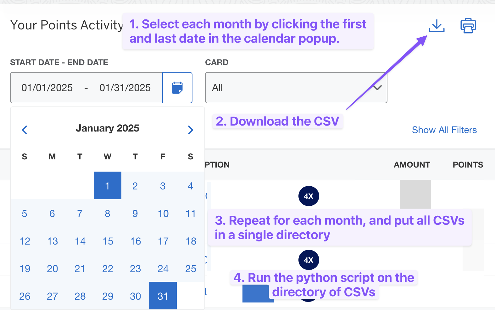

# AMEX CSV Analyzer

This Python script analyzes American Express transaction CSVs by card and reward multiplier (e.g. `4.0x`). It processes multiple exported statements and provides totals for spending and rewards per card, distinguishing `4.0x` multipliers from regular purchases.

---

## 📥 How to Export CSVs from Amex

1. Visit [https://global.americanexpress.com/rewards/summary](https://global.americanexpress.com/rewards/summary)
2. Use the calendar to select the **first and last day** of each month.
3. Click the download icon to export the CSV for that month.
4. Repeat this for each month you'd like to analyze.
5. Place all the downloaded `.csv` files into a single folder.

---

## ✅ Features

- Merges multiple CSVs into one dataset
- Cleans and standardizes dollar amounts and points/miles
- Groups and totals by card number and multiplier type (`4.0x` vs. others)
- Outputs formatted results to
